# 📚 Documentación Técnica - Sistema de Procesamiento de Estructuras Eléctricas CENS

## 📋 Tabla de Contenidos
1. [Resumen Ejecutivo](#resumen-ejecutivo)
2. [Arquitectura del Sistema](#arquitectura-del-sistema)
3. [Modelo de Datos](#modelo-de-datos)
4. [Sistema de Clasificación de Estructuras](#sistema-de-clasificación-de-estructuras)
5. [Flujo de Procesos](#flujo-de-procesos)
6. [Casos de Uso](#casos-de-uso)
7. [Componentes del Sistema](#componentes-del-sistema)
8. [API y Endpoints](#api-y-endpoints)
9. [Servicios y Lógica de Negocio](#servicios-y-lógica-de-negocio)
10. [Generación de Archivos](#generación-de-archivos)
11. [Catálogo de Materiales](#catálogo-de-materiales)
12. [Diagramas de Secuencia](#diagramas-de-secuencia)
13. [Configuración y Despliegue](#configuración-y-despliegue)
14. [Consideraciones Técnicas](#consideraciones-técnicas)

---

## 🎯 Resumen Ejecutivo

### Descripción General
El **Sistema de Procesamiento de Estructuras Eléctricas CENS** es una aplicación web desarrollada en Django que procesa archivos Excel con información de estructuras eléctricas de la empresa CENS (Centrales Eléctricas del Norte de Santander), aplica reglas de clasificación empresariales complejas, y genera archivos de salida optimizados para carga masiva en sistemas GIS.

### Características Principales
- **Procesamiento inteligente** de archivos Excel con detección automática de headers
- **Sistema de clasificación avanzado** con reglas de negocio empresariales
- **Generación dual de archivos**: Estructuras (TXT/XML) y Normas (TXT/XML)
- **Catálogo de materiales** con más de 200 códigos predefinidos
- **Mapeo jerárquico** de Unidades Constructivas a códigos de material
- **Gestión de circuitos** con lista completa de circuitos CENS
- **Validación y limpieza** de datos para carga masiva (bulk loading)
- **Codificación UTF-8 BOM** para compatibilidad con sistemas externos
- **Control de estados** definidos por usuario (salud, estructura, propietario)

### Stack Tecnológico
- **Backend**: Django 5.2.5
- **Base de Datos**: SQLite (desarrollo) / PostgreSQL (producción recomendado)
- **Procesamiento de Datos**: Pandas
- **Frontend**: HTML5, CSS3, JavaScript Vanilla
- **Formato de Archivos**: TXT con pipe (|), XML sin declaración
- **Encoding**: UTF-8 con BOM

---

## 🏗️ Arquitectura del Sistema

### Diagrama de Arquitectura General - Actualizado

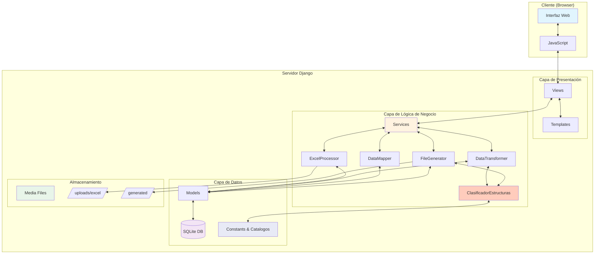

### Sistema de Clasificación de Estructuras

```mermaid
flowchart TD
    subgraph "Entrada de Datos"
        EXCEL[Archivo Excel]
        USER[Configuración Usuario]
    end
    
    subgraph "Motor de Clasificación"
        CLASIFICADOR[ClasificadorEstructuras]
        
        subgraph "Reglas de Negocio"
            R1[GRUPO → ESTRUCTURAS EYT]
            R2[CLASE → POSTE]
            R3[USO → DISTRIBUCION ENERGIA]
            R4[UC → TIPO Primario/Secundario]
            R5[Propietario → Categorización]
            R6[UC → Código Material]
            R7[Nivel Tensión → Tipo Proyecto]
            R8[Estado Salud → Conversión]
        end
    end
    
    subgraph "Catálogos"
        CAT_MAT[200+ Códigos Material]
        CAT_CIRC[150+ Circuitos CENS]
        CAT_PROP[4 Tipos Propietario]
        CAT_SALUD[3 Estados Salud]
    end
    
    subgraph "Salida"
        ESTRUCTURAS[Archivo Estructuras]
        NORMA[Archivo Norma]
    end
    
    EXCEL --> CLASIFICADOR
    USER --> CLASIFICADOR
    CLASIFICADOR --> R1
    CLASIFICADOR --> R2
    CLASIFICADOR --> R3
    CLASIFICADOR --> R4
    CLASIFICADOR --> R5
    CLASIFICADOR --> R6
    CLASIFICADOR --> R7
    CLASIFICADOR --> R8
    
    CAT_MAT --> R6
    CAT_CIRC --> ESTRUCTURAS
    CAT_PROP --> R5
    CAT_SALUD --> R8
    
    CLASIFICADOR --> ESTRUCTURAS
    CLASIFICADOR --> NORMA
    
    style CLASIFICADOR fill:#ffccbc
    style R1 fill:#fff3e0
    style R2 fill:#fff3e0
    style R3 fill:#fff3e0
    style R4 fill:#fff3e0
    style R5 fill:#fff3e0
    style R6 fill:#fff3e0
    style R7 fill:#fff3e0
    style R8 fill:#fff3e0
```

---

## 📊 Modelo de Datos

### Diagrama Entidad-Relación Actualizado

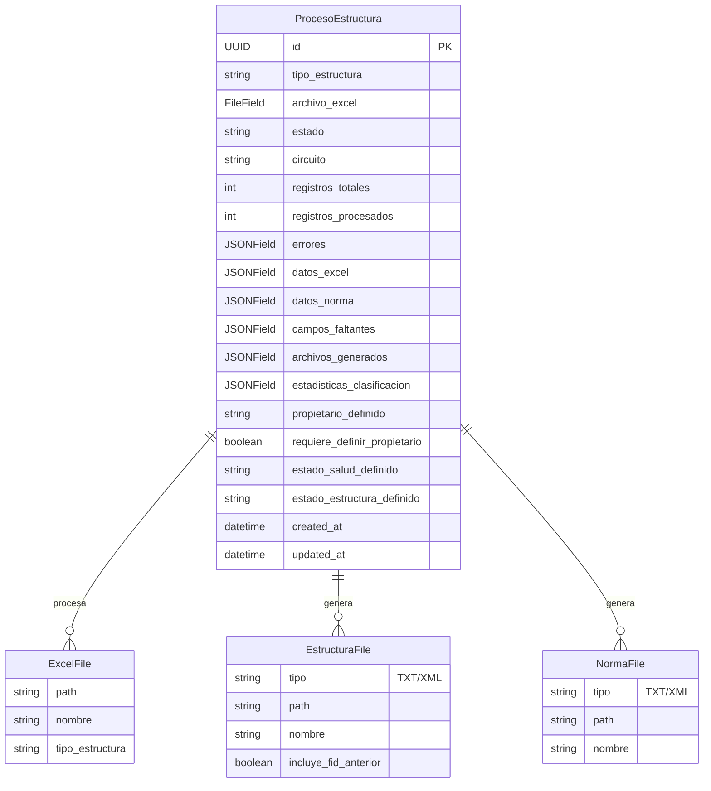

### Estados del Proceso - Actualizado

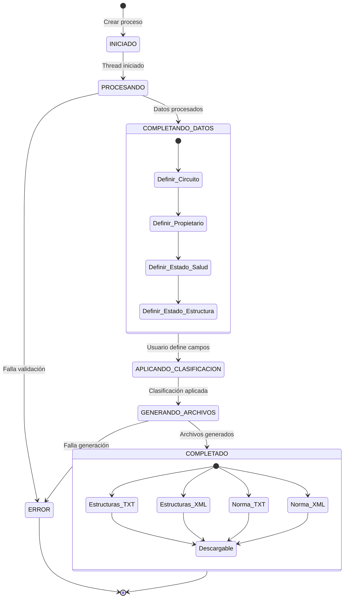

---

## 🔧 Sistema de Clasificación de Estructuras

### Reglas de Clasificación Implementadas

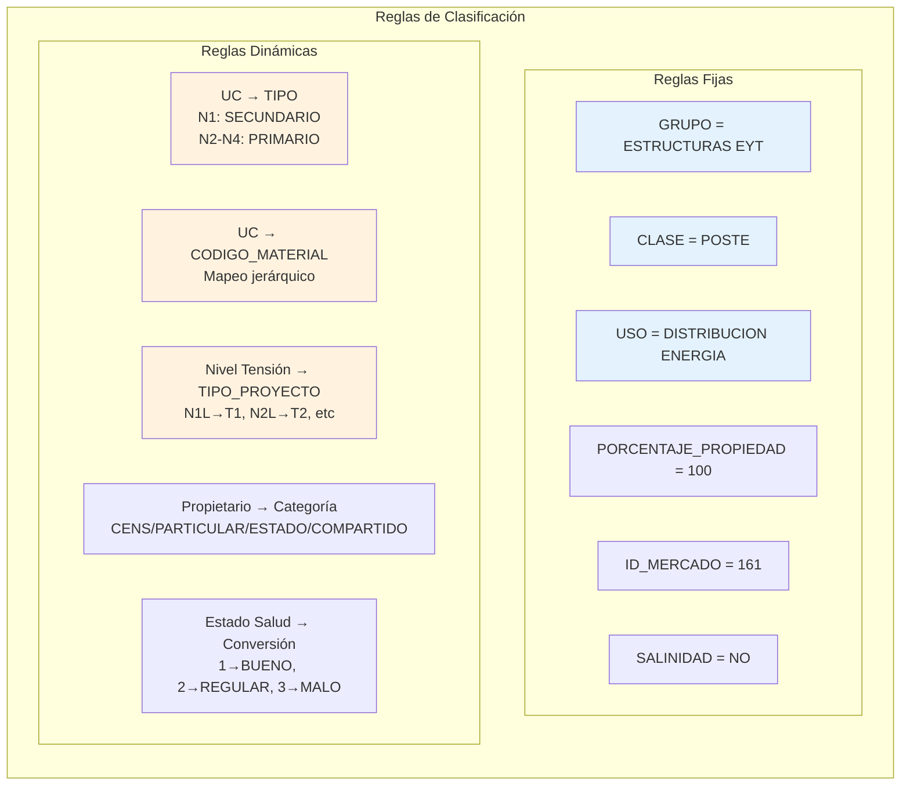

### Mapeo de Unidad Constructiva a Material

```mermaid
flowchart TD
    UC[Unidad Constructiva]
    
    UC --> D1{¿Mapeo Directo?}
    D1 -->|Sí| MD[Código Material Específico]
    D1 -->|No| D2{¿Patrón N[1-4]L[carga]?}
    
    D2 -->|Sí| PC[Asignar por Carga]
    D2 -->|No| D3{¿Altura Explícita?}
    
    D3 -->|Sí| PA[Asignar por Altura]
    D3 -->|No| D4{¿Tipo UC?}
    
    D4 -->|N1| DS[POSTE 12M 510KGF]
    D4 -->|N2-N4| DP[POSTE 14M 1050KGF]
    D4 -->|Otro| DEF[Sin Código]
    
    PC --> CM[Código Material]
    PA --> CM
    MD --> CM
    DS --> CM
    DP --> CM
    
    style UC fill:#e8eaf6
    style CM fill:#c8e6c9
```

---

## 🔄 Flujo de Procesos

### Flujo Principal del Sistema - Actualizado

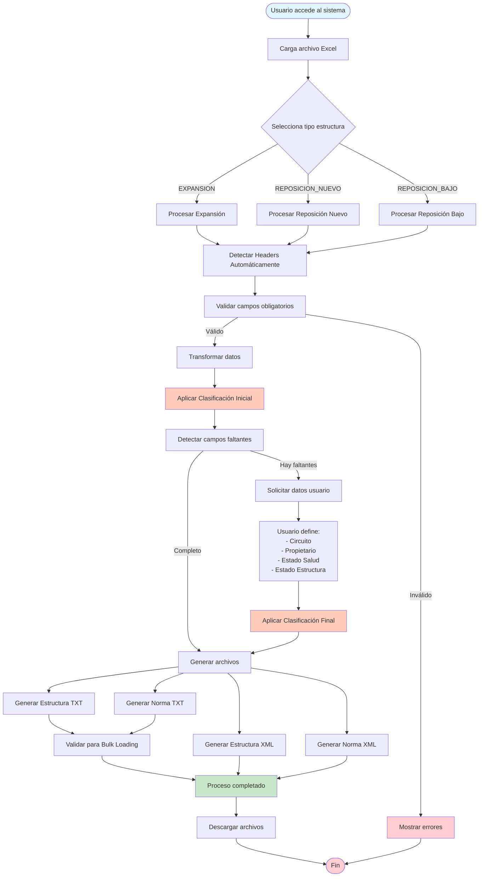

---

## 📝 Casos de Uso

### Diagrama de Casos de Uso Actualizado (PlantUML)

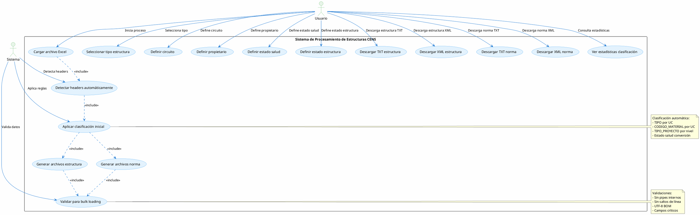

---

## 🔧 Componentes del Sistema

### Estructura de Componentes Actualizada

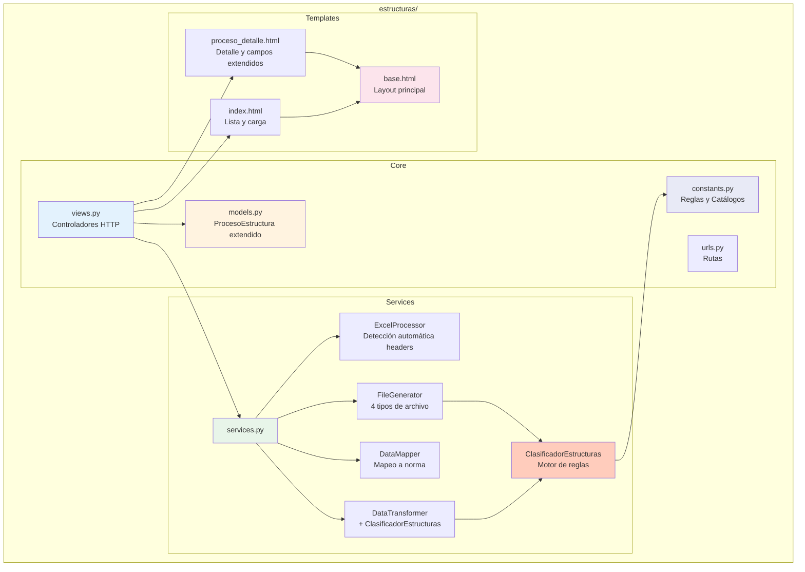

### Clases y Responsabilidades Actualizadas

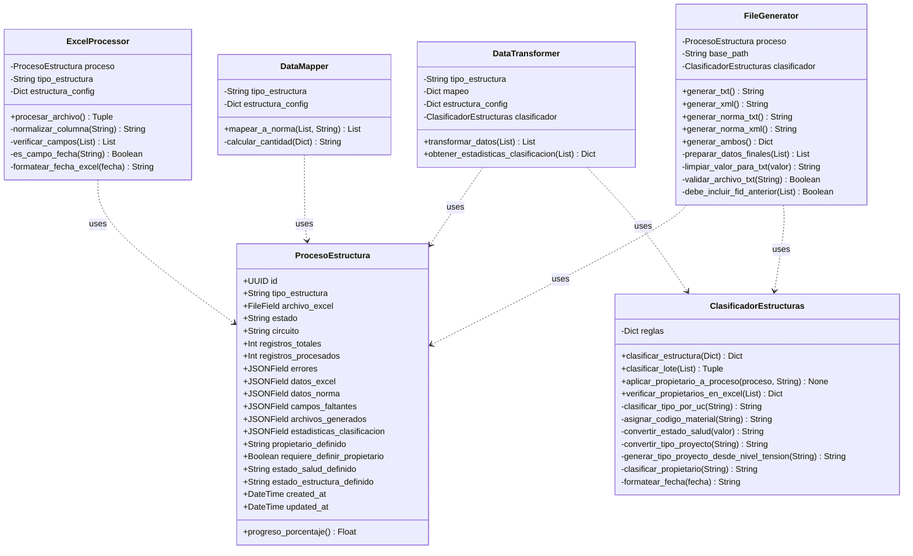

---

## 🌐 API y Endpoints

### Rutas del Sistema

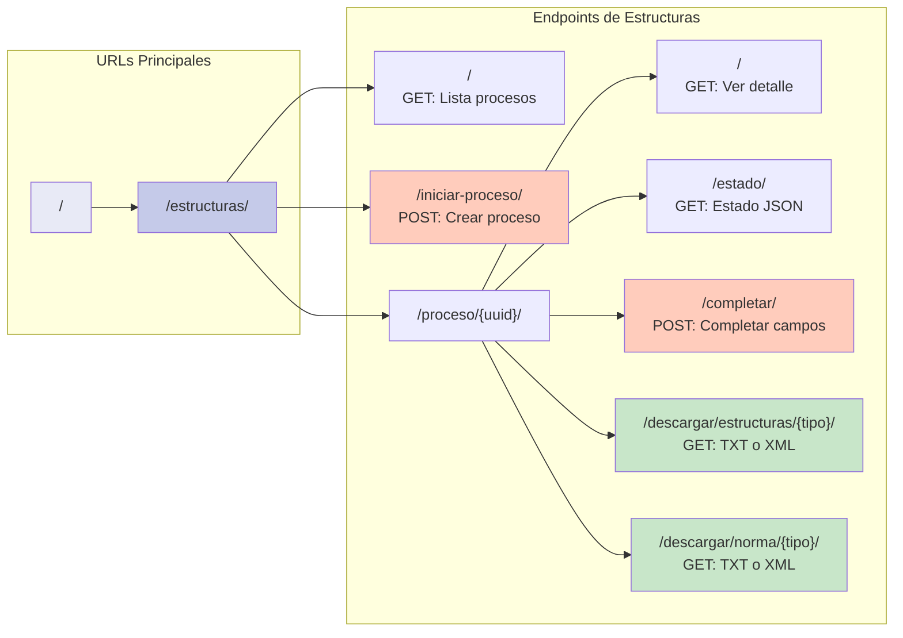

---

## ⚙️ Servicios y Lógica de Negocio

### Flujo de Procesamiento con Clasificación

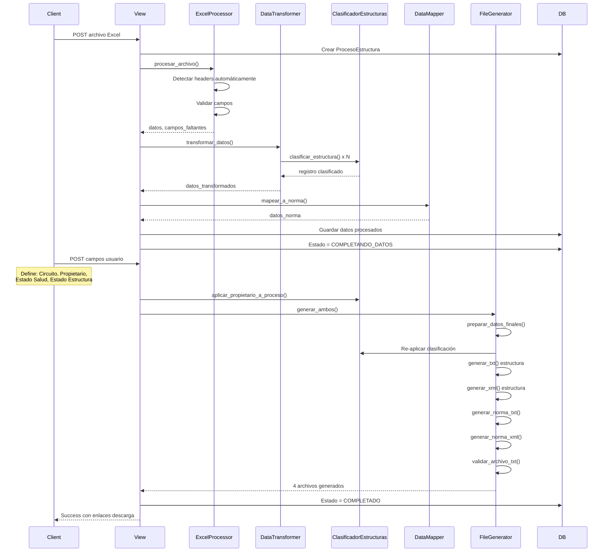

---

## 📄 Generación de Archivos

### Sistema de Generación Dual

```mermaid
graph TD
    subgraph "Datos Procesados"
        DATOS[Datos Clasificados]
    end
    
    subgraph "Archivos de Estructura"
        EST_TXT[estructuras_{uuid}.txt]
        EST_XML[estructuras_{uuid}.xml]
        
        EST_TXT_CONTENT[
            "26 campos<br/>
            Separador: |<br/>
            UTF-8 BOM<br/>
            FID_ANTERIOR condicional"
        ]
        
        EST_XML_CONTENT[
            "24 campos fijos<br/>
            Sin declaración XML<br/>
            UTF-8 BOM<br/>
            Configuración GIS"
        ]
    end
    
    subgraph "Archivos de Norma"
        NORMA_TXT[norma_{uuid}.txt]
        NORMA_XML[norma_{uuid}.xml]
        
        NORMA_TXT_CONTENT[
            "10 campos<br/>
            Separador: |<br/>
            UTF-8 BOM<br/>
            Para carga masiva"
        ]
        
        NORMA_XML_CONTENT[
            "9 campos<br/>
            Sin declaración XML<br/>
            UTF-8 BOM<br/>
            Configuración norma"
        ]
    end
    
    DATOS --> EST_TXT
    DATOS --> EST_XML
    DATOS --> NORMA_TXT
    DATOS --> NORMA_XML
    
    EST_TXT --> EST_TXT_CONTENT
    EST_XML --> EST_XML_CONTENT
    NORMA_TXT --> NORMA_TXT_CONTENT
    NORMA_XML --> NORMA_XML_CONTENT
    
    style EST_TXT fill:#c8e6c9
    style EST_XML fill:#c8e6c9
    style NORMA_TXT fill:#b3e5fc
    style NORMA_XML fill:#b3e5fc
```

### Validaciones para Bulk Loading

```mermaid
flowchart LR
    subgraph "Limpieza de Datos"
        L1[Eliminar pipes internos]
        L2[Eliminar saltos de línea]
        L3[Eliminar tabulaciones]
        L4[Normalizar espacios]
        L5[Limitar longitud 255 chars]
        L6[Normalizar Unicode]
    end
    
    subgraph "Validación de Tipos"
        V1[Coordenadas decimales]
        V2[Fechas DD/MM/YYYY]
        V3[Números enteros]
        V4[Campos críticos no vacíos]
    end
    
    subgraph "Formato Final"
        F1[UTF-8 con BOM]
        F2[Separador pipe |]
        F3[Sin comillas]
        F4[Una línea por registro]
    end
    
    L1 --> L2 --> L3 --> L4 --> L5 --> L6
    L6 --> V1
    V1 --> V2 --> V3 --> V4
    V4 --> F1
    F1 --> F2 --> F3 --> F4
    
    style L1 fill:#fff3e0
    style V1 fill:#e3f2fd
    style F1 fill:#c8e6c9
```

---

## 📦 Catálogo de Materiales

### Distribución del Catálogo

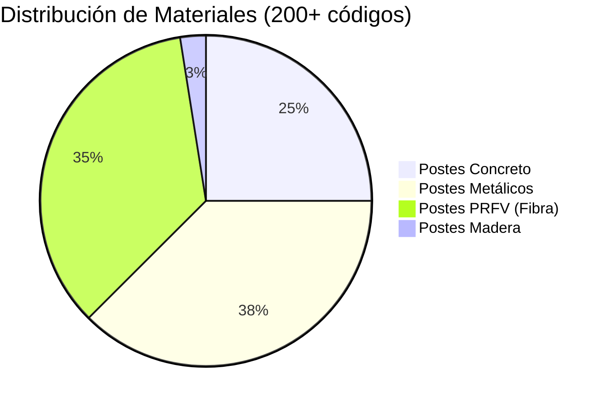

### Ejemplo de Mapeo UC → Material

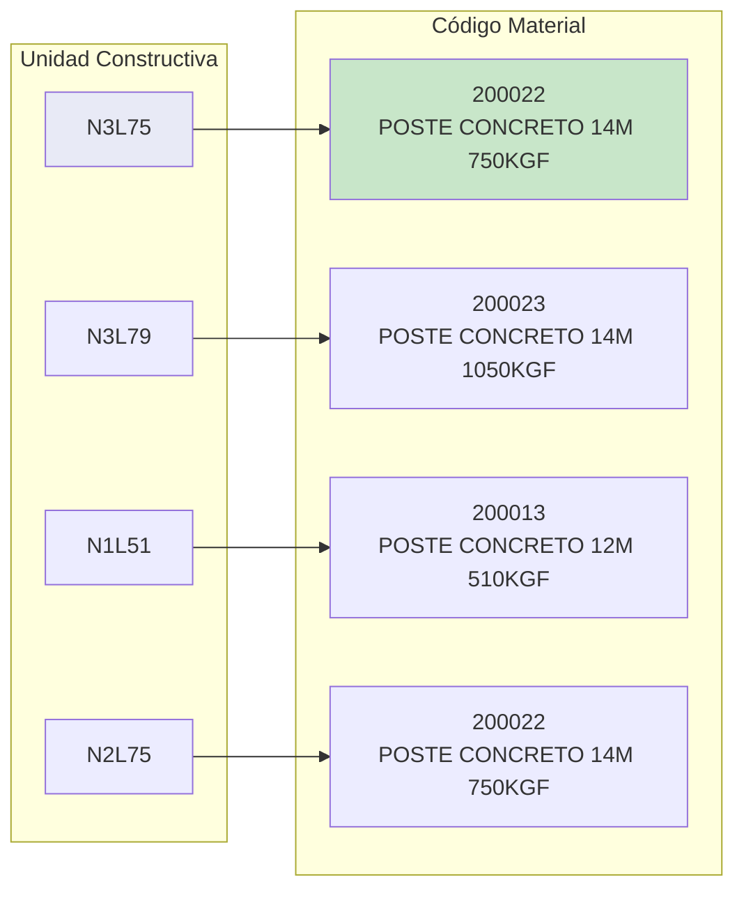

---

## 📊 Diagramas de Secuencia

### Secuencia: Proceso Completo con Clasificación

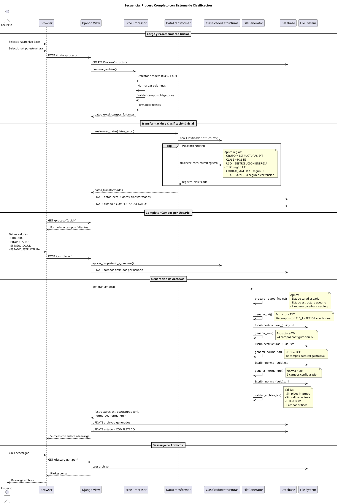

---

## 🚀 Configuración y Despliegue

### Estructura de Directorios Actualizada

```
test/
├── manage.py
├── db.sqlite3
├── DOCUMENTACION_TECNICA.md     # Esta documentación
├── mi_proyecto/
│   ├── __init__.py
│   ├── settings.py
│   ├── urls.py
│   ├── wsgi.py
│   └── asgi.py
├── estructuras/
│   ├── __init__.py
│   ├── admin.py
│   ├── apps.py
│   ├── constants.py          # Reglas, catálogos, circuitos
│   ├── models.py             # Modelo extendido
│   ├── services.py           # Lógica compleja con clasificación
│   ├── urls.py              
│   ├── views.py             
│   ├── migrations/
│   │   ├── 0001_initial.py
│   │   ├── 0002_alter_procesoestructura_tipo_estructura_and_more.py
│   │   ├── 0003_procesoestructura_campos_faltantes_and_more.py
│   │   └── 0004_procesoestructura_archivos_generados.py
│   └── templates/
│       └── estructuras/
│           ├── base.html
│           ├── index.html
│           └── proceso_detalle.html
└── media/
    ├── uploads/
    │   └── excel/           # Archivos Excel cargados
    └── generated/           # 4 tipos de archivos generados
        ├── estructuras_*.txt
        ├── estructuras_*.xml
        ├── norma_*.txt
        └── norma_*.xml
```

### Comandos de Instalación

```bash
# 1. Crear entorno virtual
python -m venv venv
source venv/bin/activate  # Linux/Mac
venv\Scripts\activate      # Windows

# 2. Instalar dependencias
pip install django==5.2.5
pip install pandas
pip install openpyxl

# 3. Migraciones de base de datos
python manage.py makemigrations
python manage.py migrate

# 4. Ejecutar servidor
python manage.py runserver

# 5. Acceder al sistema
http://127.0.0.1:8000/estructuras/
```

---

## 🔍 Consideraciones Técnicas

### Reglas de Negocio Críticas

| Regla | Descripción | Implementación |
|-------|-------------|----------------|
| **GRUPO fijo** | Siempre "ESTRUCTURAS EYT" | Hardcoded en clasificador |
| **TIPO por UC** | N1→SECUNDARIO, N2-N4→PRIMARIO | Análisis de prefijo UC |
| **Material por UC** | Mapeo jerárquico complejo | 3 niveles de mapeo |
| **FID_ANTERIOR condicional** | Solo para T1/T3, no para T2/T4 | Análisis TIPO_PROYECTO |
| **EMPRESA = PROPIETARIO** | Deben ser idénticos | Copia automática |
| **UTF-8 BOM** | Requerido para compatibilidad | encoding='utf-8-sig' |

### Validaciones Críticas para Bulk Loading

```mermaid
graph TD
    subgraph "Validaciones de Caracteres"
        VC1[Sin pipes |]
        VC2[Sin saltos línea]
        VC3[Sin tabulaciones]
        VC4[Longitud < 255]
    end
    
    subgraph "Validaciones de Formato"
        VF1[Fechas DD/MM/YYYY]
        VF2[Decimales con punto]
        VF3[Enteros sin decimales]
        VF4[UTF-8 con BOM]
    end
    
    subgraph "Validaciones de Contenido"
        VCO1[Campos críticos no vacíos]
        VCO2[Estados válidos]
        VCO3[Propietarios válidos]
        VCO4[Circuitos existentes]
    end
    
    VC1 --> VC2 --> VC3 --> VC4
    VF1 --> VF2 --> VF3 --> VF4
    VCO1 --> VCO2 --> VCO3 --> VCO4
    
    style VC1 fill:#ffcdd2
    style VF1 fill:#fff3e0
    style VCO1 fill:#e3f2fd
```

### Optimizaciones Implementadas

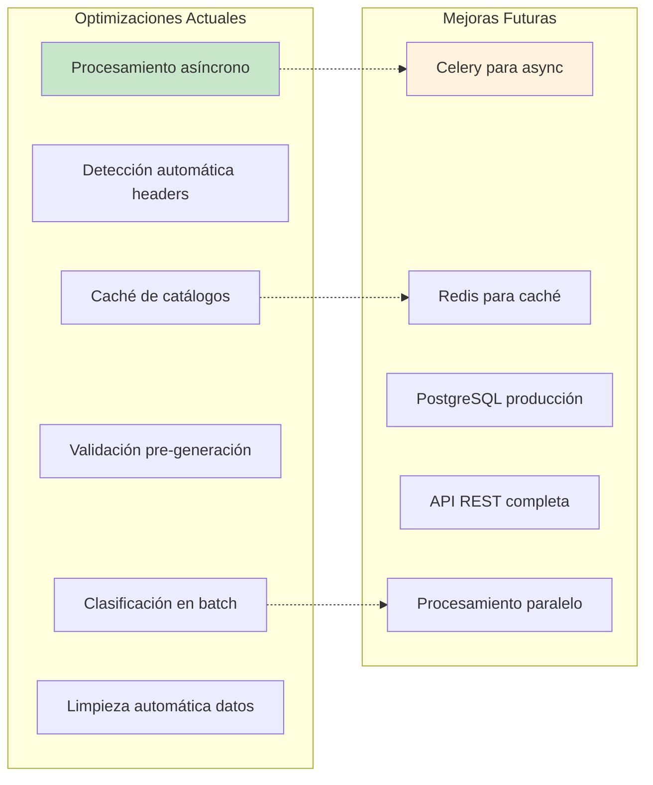

---

## 📈 Métricas y Monitoreo

### KPIs del Sistema

- **Tiempo procesamiento promedio**: ~2-5 segundos por 100 registros
- **Tasa de éxito clasificación**: 100% (reglas determinísticas)
- **Archivos generados por proceso**: 4 (2 estructura + 2 norma)
- **Tamaño promedio archivos**: 50-500 KB por archivo
- **Registros procesados diarios**: Capacidad 10,000+

### Estadísticas de Clasificación

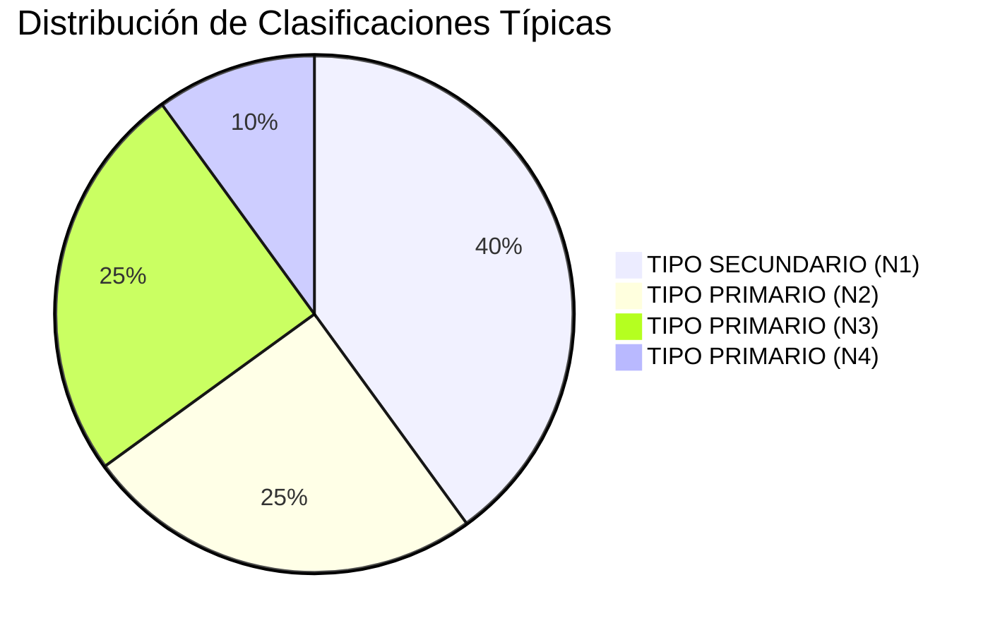

---

## 📚 Glosario Técnico Actualizado

| Término | Descripción |
|---------|-------------|
| **UC** | Unidad Constructiva (ej: N3L75) |
| **CENS** | Centrales Eléctricas del Norte de Santander |
| **FID** | Feature ID del sistema GIS |
| **Bulk Loading** | Carga masiva de datos en sistema GIS |
| **TIPO_ADECUACION** | RETENCION o SUSPENSION (sin tildes) |
| **TIPO_PROYECTO** | T1, T2, T3, T4 (convertido de romanos) |
| **PRFV** | Poste Reforzado con Fibra de Vidrio |
| **KGF** | Kilogramo-fuerza (unidad de carga) |
| **BOM** | Byte Order Mark (marca de orden de bytes UTF-8) |
| **Norma** | Especificación técnica de estructura |
| **ClasificadorEstructuras** | Motor de reglas de negocio |

---

## 🔗 Referencias y Recursos

- [Django 5.2 Documentation](https://docs.djangoproject.com/en/5.2/)
- [Pandas Documentation](https://pandas.pydata.org/docs/)
- [Python XML Processing](https://docs.python.org/3/library/xml.etree.elementtree.html)
- [UTF-8 BOM Specification](https://unicode.org/faq/utf_bom.html)
- [Mermaid Diagrams](https://mermaid-js.github.io/)
- [PlantUML](https://plantuml.com/)

---

## 📄 Información del Sistema

**Sistema de Procesamiento de Estructuras Eléctricas CENS**  
Versión: 2.0.0  
Fecha Inicial: Enero 2025  
Última Actualización: 29 de Agosto 2025  
Framework: Django 5.2.5  
Python: 3.8+  
Desarrollado para: CENS - Centrales Eléctricas del Norte de Santander

### Changelog Principal
- v2.0.0 (Agosto 2025): Sistema de clasificación completo con reglas de negocio
- v1.5.0: Generación dual de archivos (estructura + norma)
- v1.2.0: Catálogo de materiales y mapeo UC
- v1.0.0 (Enero 2025): Versión inicial con procesamiento básico

---

*Documentación técnica completa actualizada con todos los avances del sistema - Última actualización: 29/08/2025*
